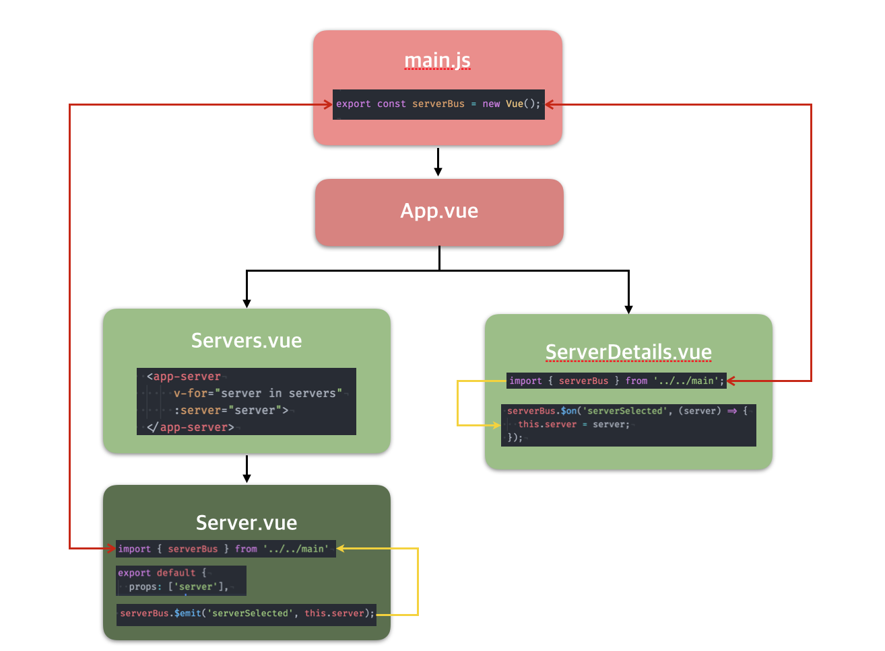

### VUEJS STUDY
---
```cli
[vue-cli](https://github.com/vuejs/vue-cli)
npm install -g vue-cli
vue init webpack-simple projectName


```

---

#### 컴포넌트 간 데이터 전달 방식



- 비 부모 자식 사이의 데이터 전달 방법
  - `Bus` 개념을 활용
    - `main.js`와 같은 가장 상위 코드에 Vue인스턴스를 중앙 이벤트 버스로 활용
    ```js
    export const serverBus = new Vue();
    ```

- `props` PARENT => CHILD.
  - 부모 컴포넌트에서 자식 컴포넌트에 데이터를 전달
  ```html
  <app-server
      :server="parent-server">
  </app-server>
  ```
  - 자식 컴포넌트에서 전달 받은 데이터 사용
  ```js
  export default {
    props: ['server']
  }
  ```
  ```html
  <li>Server #{{ server.id }}</li>
  ```

- `$emit` CHILD => PARENT.
  - 자식 컴포넌트에서 부모 컴포넌트로 데이터 전달
  ```js
  serverBus.$emit('serverSelected', this.server);
  ```

- `$on`, `v-on` PARENT Listening CHILD
  - 부모 컴포넌트에서 자식 컴포넌트에서 발생한 이벤트를 감지
  ```html
  <button-counter v-on:methodsName="eventName"></button-counter>
  ```
  ```js
    serverBus.$on('serverSelected', (server) => {
      this.server = server;
    });
  ```
